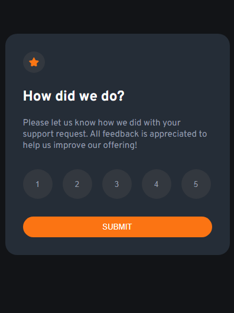
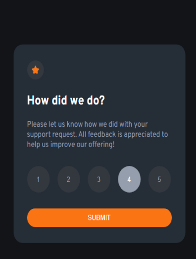
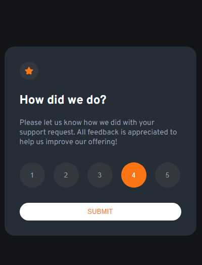
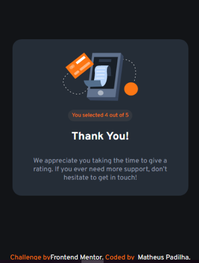

## Interactive Rating Component
<br/>

#### Projeto faz parte dos desafios do front-end-mentor


# Indice
<br/>

- <a href="#funcionalidades">Funcionalidades do projeto</a>
- <a href="#layout">Layout</a>
- <a href="#demonstração">Demonstração</a>
- <a href="#rodar">Como rodar o projeto</a>
- <a href="#tecnologias">Tecnologias utilizadas</a>
- <a href="#passos">Próximos passos</a>


## Funcionalidades

- [x] Selecionar nota Desejada.
- [x] Enviar Nota.
- [x] Tela informando nota selecionada.
- [x] Agradecimento por participar da Pesquisa.

## Layout
<br/>






## Demonstração
<br/>

[Acesse o app](https://interactive-ratingg-component.netlify.app/)

## Tecnologias Utilizadas
<br/>

1. [React](https://react.dev/)
## Como rodar este projeto
<br/>

```bash

#clonar o repositório
$git clone linkrepo

#Acessar a pasta do projeto em seu terminal
$cd interactive-rating-component

#Instalar dependencias
$npm install

#executar a aplicação
$npm start

```

## Próximos passos

- [ ] componentizar o projeto.